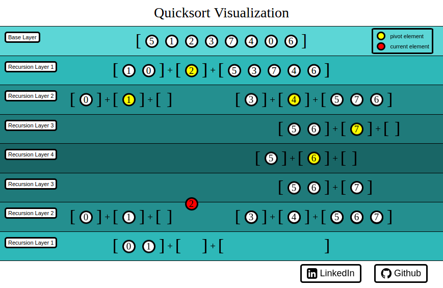

#QuicksortVisualization

[QuicksortVisualization live][github]

[github]: https://nequalszero.github.io/QuicksortVisualization/

QuicksortVisualization, as its name implies, is a front end project that provides a visualization of the Quicksort algorithm. The application utilizes the anime.js and jQuery libraries, as well as scalable vector graphics (SVG).

## Features & Implementation

### Animation of Array Elements
This algorithm visualization breaks apart the Quicksort algorithm by displaying the changes that occur as recursive calls are made during the sorting process. As elements are sorted, they animate from one recursive layer to another.

The anime.js library allows for the animation of HTML elements along SVG paths. After calculating the positions of each layer's array elements, invisible SVG paths are created based on the elements displacement from their previous layer to current layer. All HTML elements and SVG elements involved in the animation are generated with jQuery. Element animation times are calculated based on path distances, which are then used to calculate time delays for rendering each recursive layer. CSS animations are used to animate the colors of the pivot elements and current elements.

### Positioning, Sizing, and Timing Calibration
Upon initialization, the user's window dimensions are used to configure parameters regarding spacing, animation speed, and the sizes of the layers, elements, fonts, etc. Calibrating these parameters based on the user's window size allows for optimal placement when dynamically creating elements and consistent animation speeds regardless of varying path lengths.
